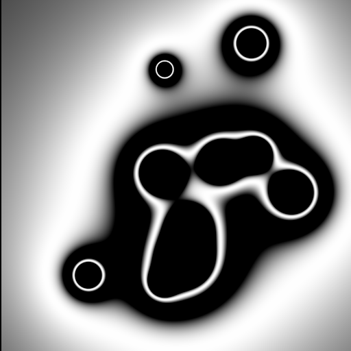

#misc

## html5_canvas_effects

Some effect tests. Example:

(Try them here)[https://gheja.github.io/misc/html5_canvas_effects]

## Octocats

I have created two Octocats like the ones you can see on [Octodex](http://octodex.github.com/) based on the [original Octocat](http://octodex.github.com/original/), these are made just for fun. For the legal things please see the [Octodex FAQ page](http://octodex.github.com/faq.html).

### github_octocat_cheshire_cat_original.svg
This Octocat is based on the Cheshire Cat from [Alice in Wonderland from 1951](http://www.imdb.com/title/tt0043274/).

### github_octocat_cheshire_cat_new.svg
This Octocat is based on the Cheshire Cat from [Alice in Wonderland from 2010](http://www.imdb.com/title/tt1014759/), the "Tim Burton version".
